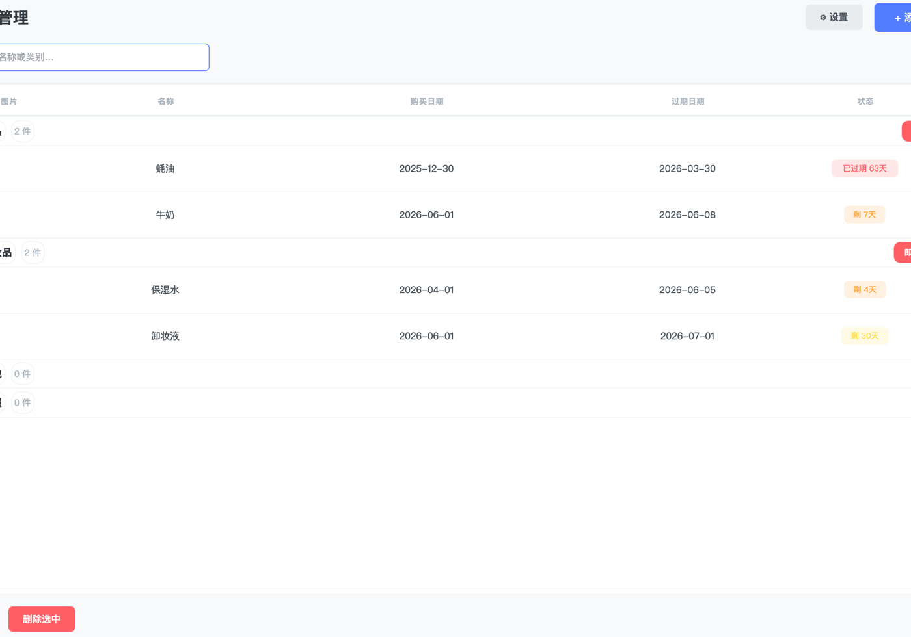
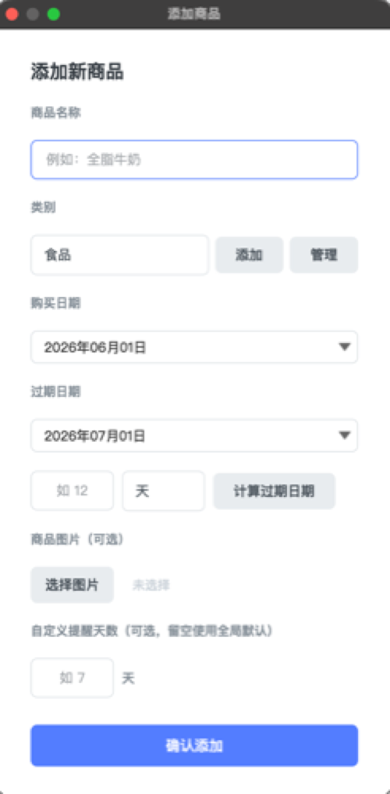
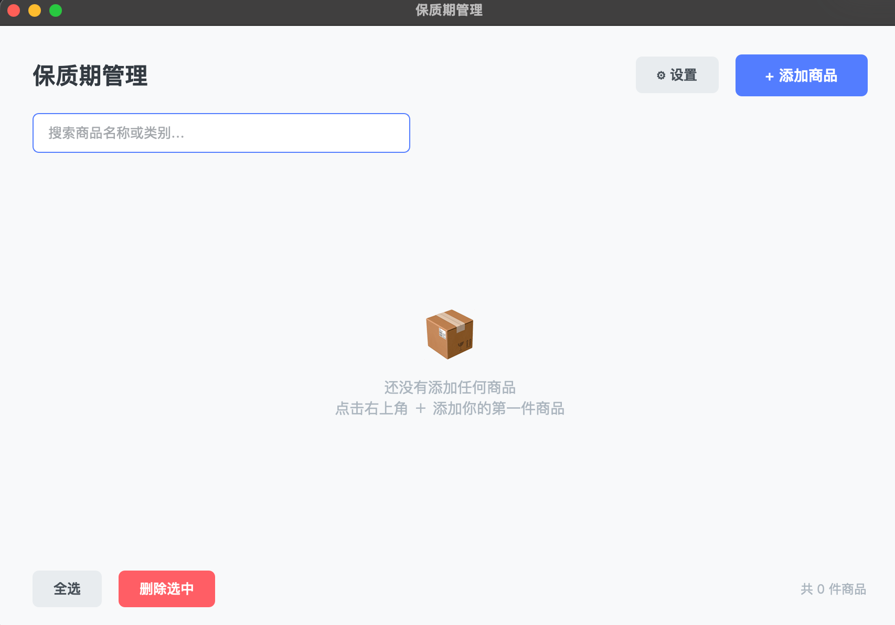

<p align="center">
  
</p>

<h1 align="center">到期管家 · Shelf Life Manager</h1>

<p align="center">
  AI 驱动的家庭到期管理工具<br>
  拍张照就完成录入 · 看一眼就知道该处理什么
</p>

<p align="center">
  <a href="#产品简介">产品简介</a> •
  <a href="#功能全景">功能全景</a> •
  <a href="#ai-核心创新">AI 核心创新</a> •
  <a href="#快速上手">快速上手</a> •
  <a href="#截图">截图</a>
</p>

---

## 产品简介

食品过期不知道、化妆品开封忘了、药品找不到保质期——这些日常小事累积下来浪费不少钱。

**到期管家**帮你解决两个最麻烦的环节：

- **📸 拍照即录入**：拍一张产品包装图，AI 自动识别品名、保质期、品类，不用手动填
- **🧠 决策式管理**：AI 综合分析你的库存，按紧急程度输出处理建议，不用自己翻列表判断

👉 [产品总览](docs/产品总览.md) · [产品需求文档](docs/PRD.md) · [技术架构](docs/技术架构.md) · [升级路线图](docs/产品升级路线图.md)

---

## 功能全景

### 基础管理

| 功能 | 说明 |
|------|------|
| 🗂️ 多品类管理 | 食品、药品、化妆品等 7 大品类 + 自定义类别 |
| ⏰ 到期提醒 | 启动弹窗 + 系统托盘定时检查，过期/即将过期一目了然 |
| 🔍 灵活筛选 | 按名称/类别关键词 + 日期范围（7/30/90 天/自定义） |
| 🖼️ 图片存档 | 每个商品可附照片，缩略图预览 + 点击大图 |
| 📤 CSV 导出 | 一键导出商品清单，Excel 兼容 |
| 🎯 空状态引导 | 首次使用友好提示 |

### AI 功能

| 功能 | 说明 |
|------|------|
| 📸 AI 拍照识别 | 拍产品包装 → AI 自动填写品名、保质期、类别（替代手动录入） |
| 📊 AI 洞察 | 4 维度报告：本周关注 / 处理建议 / 趋势发现 / 重要提醒 |
| 💬 AI 对话助手 | 侧边栏自然语言对话，可问"这周该先吃什么" |
| 💡 AI 通用建议 | 分类场景给出处理建议 |

> 无 API Key 不影响基础功能使用，AI 部分自动降级为本地规则分析。

📋 [完整功能说明](docs/产品总览.md#功能全景)

---

## AI 核心创新

AI 不是"加了个聊天框"——它改造了管理流程中的两个关键卡点：

**① 拍照即录入**
传统：手动输入品名、到期日、类别等多个字段 → 用户嫌麻烦 → 工具吃灰
改造：AI 识别包装图片自动填充 → 5 秒拍照完成录入

**② 决策式管理**
传统：按日期排列，用户逐条自行判断优先级
改造：LLM 综合分析过期天数 + 品类 + 使用习惯 → 输出个性化处理建议

🔧 [技术实现详解](docs/技术架构.md)

---

## 快速上手

### 前置条件

- Python 3.10+
- PySide6

### 安装运行

```bash
pip install PySide6
git clone https://github.com/dudumo630-byte/shelf-life-manager.git
cd shelf-life-manager
python3 shelf_life_gui.py
```

> 需要 AI 功能？在设置页填入 DeepSeek API Key（支持 OpenAI 兼容协议）。

### 打包

```bash
pip install pyinstaller
pyinstaller 到期管家.spec
```

---

## 截图

<p align="center">
  
  
</p>

<p align="center">
  
</p>

---

## 演示视频

▶️ [点击播放功能演示视频](demo/到期管家-演示.mp4)（3 分 25 秒）

---

## 项目结构

```
到期管家/
├── shelf_life_gui.py      # GUI 主程序（~2900 行）
├── shelf_life.py           # 数据层（JSON 读写 + 提醒检查）
├── docs/                   # 产品文档
│   ├── 产品总览.md         # 产品概览（从这里开始了解产品）
│   ├── PRD.md              # 产品需求文档
│   ├── 技术架构.md         # 技术选型与架构
│   ├── 产品升级路线图.md   # 未来规划
│   ├── 产品完整过程.md     # 开发全记录
│   ├── 开发笔记_2026-06.md # 开发日志
│   ├── 录屏demo制作指南.md
│   ├── 视频脚本_2分钟产品介绍.md
│   └── 小红书推广文案.md
├── demo/                   # 演示视频
├── screenshots/            # 截图
├── images/                 # 商品图片（本地生成）
├── data.json               # 商品数据（本地生成）
├── categories.json         # 类别配置
└── settings.json           # 用户设置（自动创建）
```

---

## 技术栈

```
Python 3.10+     — 开发语言
PySide6          — 桌面 GUI 框架
DeepSeek API     — AI 识别 / 洞察 / 对话（OpenAI 兼容协议）
JSON 本地存储    — 数据持久化
PyInstaller      — 应用打包
```

- ~3000 行 Python，零外部运行时依赖（除 PySide6）
- 全本地存储，数据不出设备
- 跨平台：macOS / Windows / Linux

---

## License

MIT

---

## English

A lightweight desktop tool for managing expiration dates of food, cosmetics, medicine, documents, and more. Two core AI features set it apart: photo-based auto entry (take a picture → AI fills in details) and decision support (AI analyzes your inventory and prioritizes what needs attention).

[Quick Start](#快速上手) · [Screenshots](#截图) · [Demo Video](#演示视频) · [Technical Docs](docs/技术架构.md)
