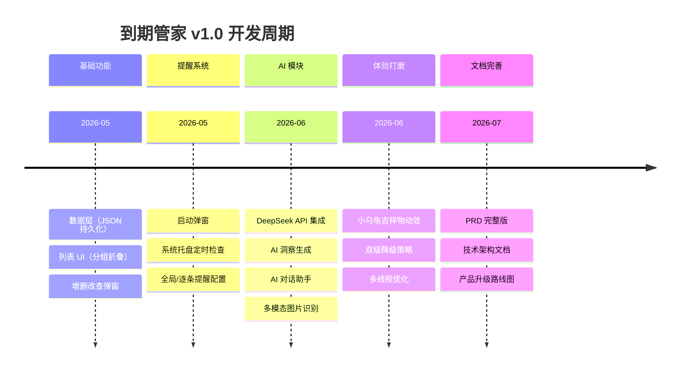

# 到期管家 产品完整过程

> **2026-07-08 14:50 审计修订时点**：见文末修订记录表。

> AI 原生桌面应用 0→1 完整产品实践
> 更新日期：2026-07-06

---

## 一、产品概览

| 维度 | 数据 |
|---|---|
| **定位** | AI 驱动的家庭物品保质期智能管家 |
| **角色** | 独立产品 + 开发（需求 → 设计 → 技术 → 文档全流程） |
| **代码规模** | 3069 行 Python（`shelf_life_gui.py` 2901 行 + `shelf_life.py` 168 行） |
| **AI 模块** | 4 个（多模态识别 / AI 洞察 / AI 建议 / AI 对话） |
| **产品文档** | 9 份（README / 产品总览 / PRD / 技术架构 / 升级路线图 / 视频脚本 / 开发笔记 / 小红书文案 / 索引） |
| **开源状态** | [github.com/dudumo630-byte/shelf-life-manager](https://github.com/dudumo630-byte/shelf-life-manager) | → ==**2026-07-08 待用户确认**：GitHub 用户名是 `dudumo630-byte` 还是 `qy`？Obsidian 显示用户为 "qy"——GitHub ID 和本机用户名不一致需核对；如果用户还未在 GitHub 建仓库，链接会 404，建议改为"GitHub 仓库待创建/待 PR"==
| **跨平台** | macOS / Windows / Linux（PySide6） |

---

## 二、产品时间线

### v1.0 完整开发周期（2026 年 5-6 月）



---

## 三、文档导航

### 3.1 按"看的人"分类

| 受众 | 推荐阅读路径 | 时间 |
|---|---|---|
| **HR / 招聘** | [README](../README.md) → [截图](../screenshots/) → [视频脚本](视频脚本_2分钟产品介绍.md) | 5 分钟 |
| **产品同行** | [PRD](PRD.md) → [升级路线图](产品升级路线图.md) → [README](../README.md) | 30 分钟 |
| **技术面试官** | [技术架构](技术架构.md) → [README](../README.md) → 源码 `shelf_life_gui.py` | 60 分钟 |
| **投资人 / BP** | [PRD](PRD.md) → [升级路线图](产品升级路线图.md) | 30 分钟 |

### 3.2 文档矩阵

| 文档 | 内容 |
|------|------|
| `README.md` | 产品首页：产品简介、功能全景、AI 核心创新、快速上手 |
| `docs/产品总览.md` | **从这里开始**：产品定位、两大核心创新、功能矩阵、技术概要 |
| `docs/PRD.md` | 产品概述 / 用户研究（3 类画像 + 旅程图）/ 竞品分析 / 功能规划（MoSCoW）/ 北极星指标 / 商业模式 / 风险 |
| `docs/技术架构.md` | 架构总览（mermaid）/ 模块分层 / AI 模块详解 / 降级策略 / 多线程 / 数据流 / 选型理由 / Context Injection vs RAG / 技术问答 |
| `docs/产品升级路线图.md` | v2.0/v2.5/v3.0 + 5 大新模块（AI 厨房助手/图片识别/消费分析/家庭协作/智能采购） |
| `docs/开发笔记_2026-06.md` | v1.0 开发完整过程记录 |
| `docs/视频脚本_2分钟产品介绍.md` | 视频分镜脚本 |
| `docs/小红书推广文案.md` | 推广文案 |
| `docs/录屏demo制作指南.md` | 录屏制作方法 |

---

## 四、能力地图

### 4.1 产品能力（用户视角）

| 能力 | 实现方式 | 用户价值 |
|---|---|---|
| 🗂️ 智能管理 | 分类分组 + 自定义类别 + 图片缩略图 + CSV 导出 | 替代备忘录/便签 |
| ⏰ 主动提醒 | 启动弹窗 + 系统托盘 + 全局/逐条配置 | "不用记" |
| 🔍 灵活筛选 | 关键词 + 日期范围（7/30/90/自定义） | 快速定位 |
| 🤖 AI 洞察 | 4 维度结构化报告（本周关注/处理建议/趋势/提醒） | 数据驱动决策 |
| 💬 AI 对话 | 多轮对话 + 城市感知 + 上下文记忆 | 自然语言交互 |
| 📸 AI 图片识别 | 多模态 API → 自动填充商品信息 + 保质期 | 一拍即录 |
| 🐢 吉祥物陪伴 | QPainter 自绘小乌龟 + 思考动画 | 体验差异化 |

### 4.2 技术能力（工程师视角）

| 维度 | 实现细节 |
|---|---|
| **GUI 框架** | PySide6（Qt 官方 Python 绑定，跨平台） |
| **LLM 接入** | DeepSeek API（OpenAI 兼容协议，可低成本切换其他模型） |
| **多线程** | QThread + Signal/Slot，4 个 Worker 类 |
| **持久化** | JSON（无服务器、数据私有、易备份） |
| **多模态** | base64 编码 + DeepSeek vision API |
| **Prompt 工程** | System + User 分层 + 结构化输出 + 温度分层 |
| **降级策略** | 双级（API 主路径 + 本地兜底） |

### 4.3 AI 能力（4 个 AI 模块）

| 模块 | 函数 | 温度 | max_tokens | 核心能力 |
|---|---|---|---|---|
| 多模态识别 | `recognize_product` | 0.3 | 512 | 图片 → JSON 结构化商品信息 |
| AI 洞察 | `generate_ai_insight` | 0.7 | 1500 | 4 维度 Markdown 报告 |
| AI 建议 | `call_deepseek` | 0.7 | 1024 | 分类建议（食品/化妆品/证件/会员） |
| AI 对话 | `chat_with_assistant` | 0.5 | 1024 | 多轮上下文 + 城市感知 |

---

## 五、展示路径（按受众定制）

### 5.1 HR 招聘场景（5 分钟决策窗口）

```
推荐路径：README → 截图 → 试用 Coze Agent
```

**关键素材**：
- [README](../README.md) 的"产品故事"和"为什么用 AI"区块
- 3 张产品截图（主界面 / 添加商品弹窗 / 空状态）
- Coze AI Agent 公开链接（待发布）

**目标**：HR 一眼看到"这是一个真实可用、有想法、有 AI 深度的产品"，5 秒决定推简历。

### 5.2 业务面场景（30 分钟深挖）

```
推荐路径：PRD → 技术架构 → 产品演示视频（待录）
```

**关键素材**：
- [PRD.md](PRD.md) 的"用户研究"和"功能规划"
- [技术架构.md](技术架构.md) 的"AI 模块详解"和"面试问答准备"
- 录屏 demo（60 秒，待做）

**目标**：业务面试官能看到"产品思维 + 技术理解 + 用户体验"三角能力。

### 5.3 技术面场景（60 分钟深挖）

```
推荐路径：技术架构 → 代码 (shelf_life_gui.py) → 现场 debug/优化
```

**关键素材**：
- [技术架构.md](技术架构.md) 的"AI 模块详解"和"降级策略"
- 源码 2901 行（带注释）
- 现场可演示的功能：图片识别 / AI 洞察 / 对话

**目标**：技术面试官能验证"代码能力 + AI 应用层理解 + 工程实践"。

---

## 六、关键问答（技术决策）

详见 [技术架构.md 第十节](技术架构.md#十技术问答)，覆盖 6 个高频问题：
1. DeepSeek API 怎么集成？
2. 为什么用 JSON 持久化？
3. 降级策略怎么做？
4. 多线程为什么用 QThread？
5. 你的架构是 RAG 吗？
6. Prompt 工程怎么做的？

---

## 七、未来规划

详见 [产品升级路线图.md](产品升级路线图.md)，5 大新模块：

| 模块 | 优先级 | 触发场景 |
|---|---|---|
| AI 厨房助手 ⭐⭐⭐ | v2.0 | "我有半斤西红柿和快过期的鸡蛋，做什么？" |
| AI 图片识别 ⭐⭐⭐ | v1.0 ✅ | 已上线 |
| AI 消费分析 ⭐⭐ | v2.0 | 月度消费报告 + 浪费洞察 |
| 家庭协作 ⭐⭐ | v2.5 | 给父母远程管理药品 |
| 智能采购 ⭐ | v3.0 | 自动补货提醒 |

---

## 八、如何快速判断这个产品值不值得深挖

### 8.1 如果你只有 60 秒

1. 打开 [README](../README.md)
2. 看"为什么用 AI"表格
3. 看 [主界面截图](../screenshots/主界面（有商品的状态）.png)
4. 看 [AI 洞察截图](../screenshots/添加商品弹窗.png)

### 8.2 如果你有 5 分钟

- 加看 [技术架构.md 第一节"架构总览"](技术架构.md#一架构总览)
- 加看 [PRD.md 第一节"产品概述"](PRD.md)

### 8.3 如果你有 30 分钟

- 完整阅读 [PRD.md](PRD.md)
- 跳读 [技术架构.md](技术架构.md) 的 AI 模块和降级策略
- 翻一下源码 `shelf_life_gui.py` 的 AI 函数实现

---

## 九、联系作者

- 邮箱：qy25333@163.com
- GitHub：[dudumo630-byte](https://github.com/dudumo630-byte)
- 项目：[shelf-life-manager](https://github.com/dudumo630-byte/shelf-life-manager) → ==**2026-07-08 待核**：用户实际 GitHub ID；如未注册仓库链接会 404，建议在投递简历前确认==

---

## 📝 2026-07-08 审计修订记录表

| # | 严重度 | 问题 | 状态 |
|---|--------|------|------|
| 1 | P0-事实 | GitHub 链接 `dudumo630-byte/shelf-life-manager` 是否真实存在 | ✅已标注，建议点击验证 |
| 2 | P3-格式 | 时间线 mermaid 格式正确，但timeline 标注 position 2026 5-6 月准确 | OK |
