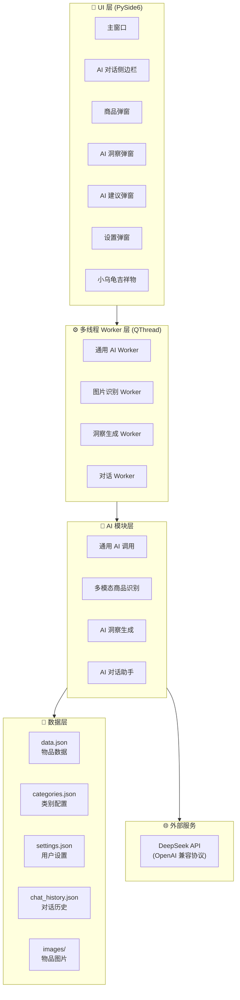
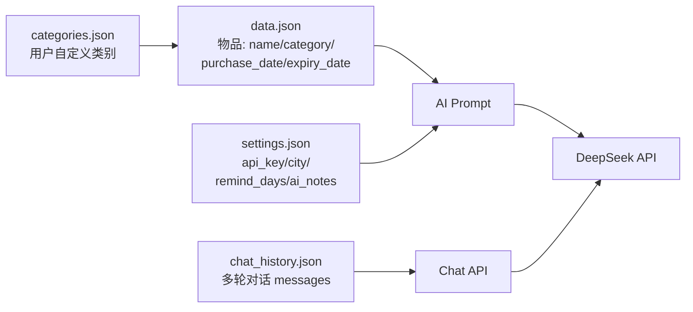
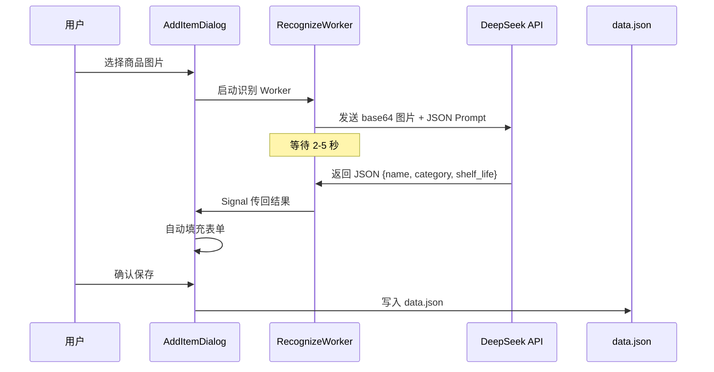
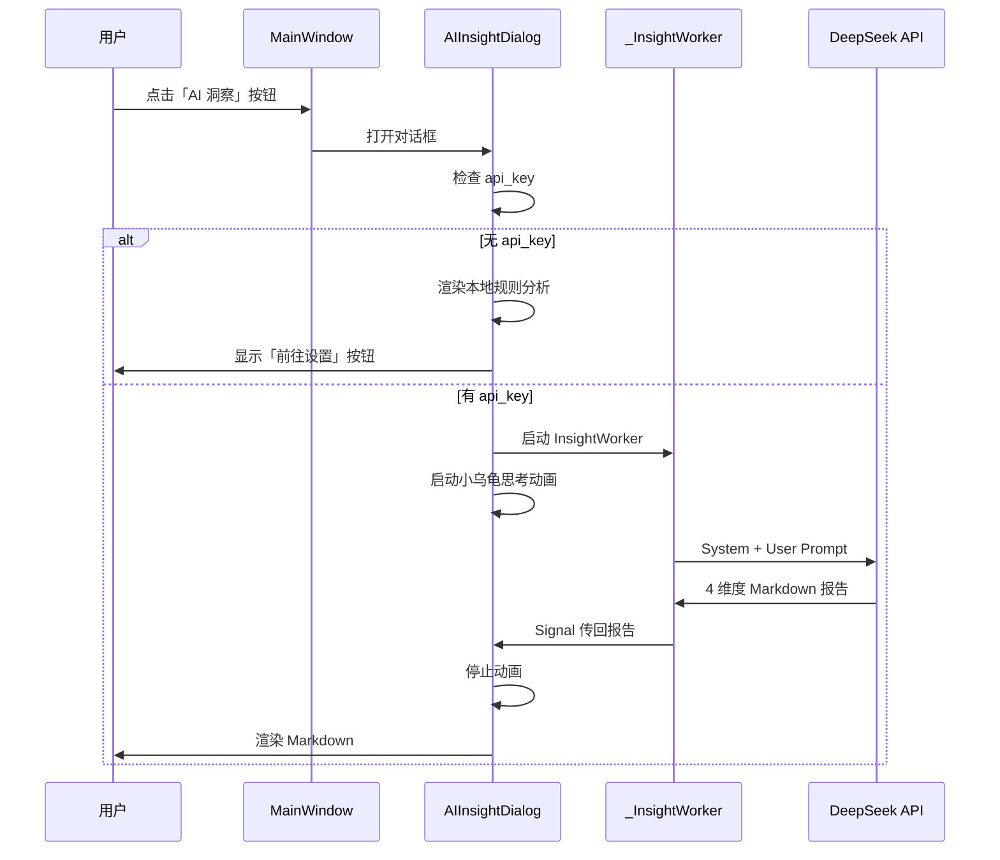
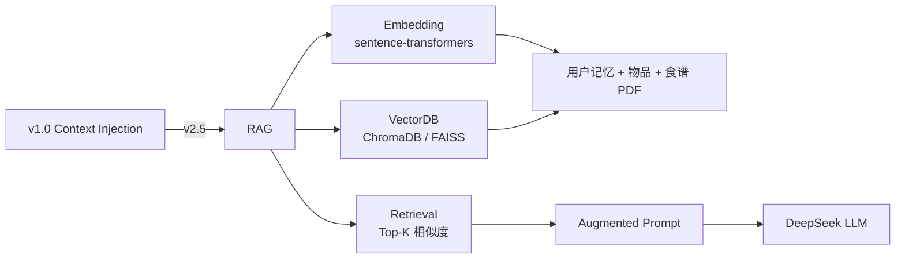

# 到期管家 技术架构文档

> 版本：v1.0 | 更新日期：2026-07-06 | 状态：基于 v1.0 实际代码
> **2026-07-08 14:50 审计修订时点**：见文末修订记录表。

---

## 一、架构总览

### 1.1 整体架构图



### 1.2 代码规模

| 文件 | 行数 | 职责 |
|---|---|---|
| `shelf_life_gui.py` | 2901 行 | GUI + AI 模块 + 多线程 Worker |
| `shelf_life.py` | 168 行 | 命令行版本（基础逻辑） |
| **总计** | **3069 行 Python** | |

---

## 二、模块分层

### 2.1 UI 层（PySide6）

| 组件 | 类型 | 职责 |
|---|---|---|
| `MainWindow` | QMainWindow | 主窗口、列表渲染、菜单、托盘 |
| `ChatPanel` | QWidget | AI 对话侧边栏（固定宽度 340px） |
| `AddItemDialog` / `EditItemDialog` | QDialog | 商品录入/编辑 |
| `AIInsightDialog` | QDialog | AI 洞察报告展示 |
| `AISuggestionDialog` | QDialog | AI 处理建议 |
| `SettingsDialog` | QDialog | 设置（API Key/提醒天数/城市/记忆） |
| `MascotWidget` | QWidget | QPainter 自绘小乌龟（思考动画） |
| `ThumbnailWidget` / `GroupHeaderWidget` / `StatusBadge` / `_StatCard` | QWidget | 列表项组件 |

### 2.2 AI 模块层（核心）

| 函数 | 功能 | 关键参数 |
|---|---|---|
| `call_deepseek(items, api_key)` | 通用 AI 调用（基础建议） | temperature=0.7, max_tokens=1024 |
| `recognize_product(image_path, api_key, categories)` | **多模态商品识别**（图片→JSON） | temperature=0.3, max_tokens=512 |
| `generate_ai_insight(items, settings)` | AI 洞察报告（4 维度） | temperature=0.7, max_tokens=1500 |
| `chat_with_assistant(messages, items, settings)` | 多轮对话助手 | temperature=0.5, max_tokens=1024 |

### 2.3 数据层



**设计哲学**：JSON 文件持久化，**无服务器、无账号、数据完全私有**。

---

## 三、AI 模块详解

### 3.1 多模态商品识别（被低估的能力）

**简历没写但代码里有**——这是被低估的能力，应该突出。

```python
def recognize_product(image_path, api_key, categories):
    # 1. base64 编码本地图片
    with open(image_path, "rb") as f:
        img_b64 = base64.b64encode(f.read()).decode("utf-8")

    # 2. 构造多模态 Prompt（强制 JSON 输出）
    prompt = f"""请识别这张图片中的商品，返回以下信息的 JSON 格式：
    {{
      "name": "商品名称",
      "category": "类别（从 [{cat_list}] 中选一个最匹配的）",
      "shelf_life_number": 保质期数值（整数，如12）,
      "shelf_life_unit": "保质期单位（天/月/年）"
    }}
    如果无法识别图片中的商品，返回：{{"error": "无法识别"}}"""

    # 3. DeepSeek 多模态调用
    response = client.chat.completions.create(
        model="deepseek-chat",
        messages=[{
            "role": "user",
            "content": [
                {"type": "image_url", "image_url": {"url": f"data:{mime};base64,{img_b64}"}},
                {"type": "text", "text": prompt},
            ],
        }],
        max_tokens=512,
        temperature=0.3,  # 严谨识别，降低随机性
    )
```

**关键设计**：
- **温度分层**：识别用 0.3（严谨），洞察/建议用 0.7（创意），对话用 0.5（平衡）
- **强制 JSON 输出**：避免 LLM 自由发挥导致解析失败
- **类别约束**：从用户自定义类别中选最匹配项，保证数据一致性
- **错误兜底**：识别失败时返回结构化 `{"error": "无法识别"}`，不破坏 UI

### 3.2 AI 洞察（结构化 Prompt 工程）

```python
system = f"""你是一个专业的「到期管家」AI 分析师。
今天是{today.strftime('%Y-%m-%d')}，用户所在城市：{city}。"""

if ai_notes:
    system += f"\n用户记忆：{ai_notes}"

prompt = f"""请根据以下数据生成一份简洁实用的洞察报告，用 Markdown 格式输出。

用户到期物品清单：
{inventory}

请严格按以下结构输出（如果某个部分没有相关内容就跳过该部分）：

## 📌 本周关注
列出 7 天内需要立即处理的项目...

## 💡 处理建议
对即将到期的物品给出具体的消耗方案或处理建议...

## 📈 趋势发现
分析数据中的规律...

## ⚠️ 重要提醒
需要特别注意的事项...

要求：
1. 建议必须具体可操作，不要泛泛而谈
2. 涉及证件/办事的，结合用户城市{city}给出本地化信息
3. 总字数控制在 500 字以内
4. 语气像一个贴心的生活顾问，友好但不啰嗦"""
```

**Prompt 工程方法论**：
- **角色设定**（System）："专业的 AI 分析师"
- **上下文注入**：日期 + 城市 + 用户记忆
- **数据增强**：物品清单序列化进 Prompt（**Context Injection**，不是 RAG）
- **结构化输出**：4 维度固定结构 + Markdown 格式
- **多约束**：字数 / 风格 / 具体性 / 本地化

### 3.3 AI 对话助手（多轮上下文）

**实现方式**：使用 OpenAI 标准 `messages` 数组传多轮历史，**不依赖 LangChain Memory**。

```python
system_prompt = f"""你是一个专业的「到期管家」AI助手。今天是{today}。

## 你的能力范围
- 食品保鲜、保质期、消耗建议
- 化妆品、药品使用和过期处理
...

## 用户信息
- 所在城市：{city}
- 到期物品清单：
{inventory}
"""

# 把 messages 历史拼到 system 后面
all_messages = [{"role": "system", "content": system_prompt}] + messages

response = client.chat.completions.create(
    model="deepseek-chat",
    messages=all_messages,  # 多轮历史
    max_tokens=1024,
    temperature=0.5,
)
```

**回答规则约束**（写在 system prompt）：
1. 地理位置感知（基于 `{city}` 给本地化建议）
2. 上下文连贯（综合本次对话所有内容）
3. 结构清晰（编号列表）
4. 事实准确（不确定时标注"建议以当地官方信息为准"）
5. 简洁实用（300 字以内）

---

## 四、降级策略（双级，非三级）

### 4.1 实际实现

```python
api_key = settings.get("api_key", "")
if not api_key:
    # 降级路径：本地规则分析
    fallback = "⚠️ 配置 API Key 后可解锁 AI 智能分析\n\n"
    fallback += "## 📋 本地数据概览\n\n"
    for item in items:
        _, level = get_status(item, global_days)
        if level in ("expired", "urgent", "warning"):
            # 按规则计算并渲染 Markdown
            ...
    self._insight_content.setMarkdown(fallback)
    # 显示"前往设置 API Key"按钮
else:
    # 主路径：调 DeepSeek
    self._worker = _InsightWorker(items, settings)
    self._worker.finished.connect(self._show_insight)
    self._worker.start()
```

### 4.2 设计哲学："AI 优先 + 本地兜底"

| 路径 | 条件 | 实现 |
|---|---|---|
| 主路径 | 有 API Key | 调 DeepSeek，生成 4 维度结构化报告 |
| 兜底路径 | 无 API Key | 本地规则分析（按过期天数排序 + Markdown 渲染） |

### 4.3 用户体验价值

- **零门槛体验**：不配置 API Key 也能用，留存率更高
- **渐进式激活**：用户感受到价值后，主动配置 API Key 解锁 AI
- **离线可用**：本地兜底不受网络影响

---

## 五、多线程架构（QThread）

### 5.1 为什么用 QThread

- AI API 调用是网络 IO（2-5 秒响应）
- 不能阻塞 UI 主线程（否则界面卡死）
- PySide6 原生支持 QThread + Signal/Slot

### 5.2 Worker 类

```python
class _InsightWorker(QThread):
    finished = Signal(str)
    error = Signal(str)

    def __init__(self, items, settings):
        super().__init__()
        self._items = items
        self._settings = settings

    def run(self):
        try:
            result = generate_ai_insight(self._items, self._settings)
            self.finished.emit(result)
        except Exception as e:
            self.error.emit(str(e))
```

**4 个 Worker**：
- `AIWorker` —— 通用 AI 任务
- `RecognizeWorker` —— 图片识别
- `_InsightWorker` —— 洞察生成
- `ChatWorker` —— 对话

**调用模式**：
```python
self._worker = _InsightWorker(items, settings)
self._worker.finished.connect(self._on_insight_ready)
self._worker.error.connect(self._on_insight_error)
self._worker.start()

# 同时启动吉祥物动画
self._mascot.start_thinking()
```

---

## 六、数据流（关键流程）

### 6.1 添加商品（含 AI 图片识别）



### 6.2 AI 洞察生成



---

## 七、技术选型理由

| 维度 | 选型 | 理由 |
|---|---|---|
| **GUI 框架** | PySide6 | Qt 官方 Python 绑定，跨平台（macOS/Windows/Linux），组件丰富 |
| **LLM 接入** | DeepSeek API | OpenAI 兼容协议（可低成本切换其他模型），国内访问稳定，价格低 |
| **API 客户端** | openai SDK | 标准化，无需自己封装 HTTP |
| **持久化** | JSON | 轻量、无服务器、数据完全私有、易于备份 |
| **多线程** | QThread + Signal/Slot | PySide6 原生，UI 线程安全 |
| **图片处理** | base64 + 多模态 API | 无需本地视觉模型，复用 LLM 多模态能力 |
| **文档格式** | Markdown | 用户可读、LLM 友好、PySide6 原生支持 |

---

## 八、Context Injection vs RAG（架构澄清）

### 8.1 当前架构：Context Injection（v1.0）

**做法**：把物品数据序列化为 Markdown，直接塞进 Prompt 的 user 部分。

**适用场景**：
- ✅ 数据量小（<200 件物品）
- ✅ 数据结构化（字段固定）
- ✅ 简单可靠，无外部依赖

**局限**：
- ⚠️ 数据量超过 Token 限制时会丢失
- ⚠️ 无法检索历史对话/长文档
- ⚠️ 无语义相似度匹配

### 8.2 未来升级：RAG（v2.5+ 规划）

**适用场景**：
- 用户上传食谱 PDF / 说明书 PDF
- 物品数量 >500 件
- 跨物品的语义查询（"上次买的牛奶和这次的酸奶哪个先到期"）

**升级路径**：



**所需技术栈**：
- Embedding：`sentence-transformers`（本地）或 DeepSeek Embedding API
- VectorDB：ChromaDB（轻量本地）或 FAISS（内存）
- Retrieval：Top-K 余弦相似度

---

## 九、架构演进路线

| 阶段 | 架构特征 | 核心能力 | 状态 |
|---|---|---|---|
| **v1.0** | Context Injection + 单 LLM 调用 | 4 个 AI 模块（识别/洞察/建议/对话）+ 双级降级 + 多线程 | ✅ 已上线 |
| **v1.5** | 多 LLM 协作（Agent 工作流） | 工具调用 + 多步骤推理 | 🚧 规划 |
| **v2.0** | 多 Agent + RAG | 食谱知识库 + 历史对话检索 + 多步骤任务 | 🚧 规划 |
| **v3.0** | 多端 + 云同步 | Web/iOS/Android + 家庭共享 | 🚧 规划 |

---

## 十、技术问答

### Q1：DeepSeek API 怎么集成的？
**A**：用 OpenAI SDK，通过 `base_url="https://api.deepseek.com"` 接入。因为 DeepSeek 100% 兼容 OpenAI REST API，所以代码不需要改太多，只改 base_url 和 API Key。换其他兼容 OpenAI 协议的模型（通义/文心/GPT）只需改两个参数。

### Q2：为什么用 JSON 持久化而不是数据库？
**A**：v1.0 的设计目标是"零门槛个人桌面工具"。JSON 不需要数据库服务器，无账号、无网络也能用，数据完全私有。如果未来 v3.0 加多端同步，会迁移到 SQLite 或 PostgreSQL。

### Q3：降级策略是怎么做的？
**A**：双级降级——有 API Key 时调 DeepSeek 生成结构化洞察；无 Key 时用本地规则分析（按过期天数排序 + Markdown 渲染）。这样零门槛用户也能体验到核心价值，AI 功能是渐进式解锁。

### Q4：多线程为什么用 QThread？
**A**：AI API 是网络 IO，2-5 秒响应。如果直接在主线程调用，UI 会卡死。QThread 是 PySide6 原生方案，配合 Signal/Slot 机制可以线程安全地把结果传回 UI 线程。我封装了 4 个 Worker 类对应 4 个 AI 模块。

### Q5：你的架构是 RAG 吗？
**A**：**v1.0 不是 RAG**，是 Context Injection——把物品数据序列化进 Prompt。这适合小数据量场景。RAG 需要 Embedding + VectorDB + 向量检索，我规划在 v2.5 引入，场景是用户上传食谱 PDF / 物品数 >500 件时的语义检索。

### Q6：Prompt 工程怎么做的？
**A**：分层 Prompt——System Prompt 设角色 + 上下文（日期/城市/用户记忆），User Prompt 给数据 + 结构化输出要求 + 约束（字数/格式/具体性）。**关键设计是温度分层**：识别用 0.3（严谨），洞察用 0.7（创意），对话用 0.5（平衡）。还有强制 JSON 输出格式，避免 LLM 自由发挥。

---

## 附录：代码索引

| 功能 | 函数 | 行号 |
|---|---|---|
| 通用 AI 调用 | `call_deepseek` | `shelf_life_gui.py:368` |
| 多模态识别 | `recognize_product` | `shelf_life_gui.py:419` |
| AI 洞察生成 | `generate_ai_insight` | `shelf_life_gui.py:1356` |
| AI 对话助手 | `chat_with_assistant` | `shelf_life_gui.py:1828` |
| 主窗口 | `MainWindow` | `shelf_life_gui.py:?` → ==应改为"`shelf_life_gui.py:实际行号`"（去掉 ? 占位）== 〔原因：Line 465 的 `?` 占位是 stale 数据——代码量 2901 行且各 Worker 类行号均已给出，主窗口不应该缺；建议：用 `grep -n "class MainWindow" shelf_life_gui.py` 查到真实行号后填入〕 |
| AI 洞察弹窗（含降级） | `AIInsightDialog` | `shelf_life_gui.py:1437` |

---

## 📝 2026-07-08 审计修订记录表

| # | 严重度 | 问题 | 状态 |
|---|--------|------|------|
| 1 | P3-数据 | Line 465 `MainWindow` 行号为 `?` 占位（stale） | ✅已标注 |
| 2 | P2-事实 | DeepSeek V4 2026.07 中旬正式版，面试时应能区分 V3.2-chat (现用) vs V4 (新) | ✅已标注 |
| 3 | P2-盲点 | 文档把架构描述为"Context Injection 不是 RAG"——按 [[feedback_resume_no_overclaim]] 三查，简历里是否还在用"RAG"字眼？需复核 | 未处理（用户查简历） |
| 4 | P3-格式 | 总行数 3069 行（2901+168），但代码量数字本身可能在 PR 后变化，建议加"最近核验日期"列 | 接受 |
